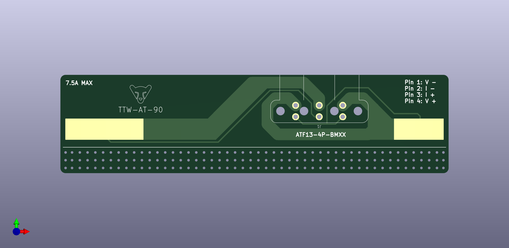

# Transition To Wire (TTW)
---
The Transition to Wire device is a printed circuit board designed to facilitate the transition from tab ribbon or other unsecured electrical contacts on research samples to either wires or a connector.  The four pin connector provides a kelvin (4 wire) connection at the solder pad where the sample connects.  Depending on quantity ordered, the PCBs cost well under US $1.00 each.  Connectors cost under US $7.00 each.

## Features
---
- Provides strain relief to fragile sample connections
- Facilitates use of the same connection across multiple samples
- Low cost and easy to install to samples

## Versions
---
Three versions of TTWs are in active use so far.  Two utilize a soldered in Amphenol AT connector which allows for easy interfacing with a sample.  The only difference between these two is the exact location of the connector and solder pads.  The other style is designed to allow for wires to be attached to a sample with strain relief.

| Model    | Connector     | Description                                |
| -------- | ------------- | ------------------------------------------ |
| AT-90    | ATF13-4P-BM03 | Bipolar board with 90 degree AT 4 pin jack |
| AT-90 V2 | ATF13-4P-BM03 | Bipolar board with 90 degree AT 4 pin jack |
| TTW      | None          | Unipolar board with wire solder pads       |

## Manufacture
---
Each TTW design has its own set of Gerber files required for a manufacturer to fabricate the boards.  If you just want to manufacture an existing design, download the set of Gerber files and upload them to a board manufacturer of your choice using the manufacturing specifications below.

Design files are also available if you wish to modify an existing design to meet your specific needs.  These PCBs were drafted in KiCAD.

| Model    | Material | Thickness | PCB Color | Silkscreen Color | Copper Weight |
| -------- | -------- | --------- | --------- | ---------------- | ------------- |
| AT-90    | FR4      | 1.6mm     | Black     | White            | 1 oz          |
| AT-90 V2 | FR4      | 1.6mm     | Black     | White            | 1 oz          |
| TTW      | Aluminum | 1.6mm     | Black     | White            | 1 oz          |

## Bill of Materials
---
There is only one component used on the AT style TTW boards.  This connector can be purchased in both tin plated and gold plated.  Gold plated is unnecessary in most applications because of the four wire nature of the connector.  AT series connectors are rated at 250V and 13A.  The TTW board is estimated at about 7A ampacity and a track spacing of 0.5mm should satisfy the 250V rating, though this has not been tested.

| Part Number   | Description                                               |
| ------------- | --------------------------------------------------------- |
| ATF13-4P-BM03 | 90 degree Amphenol 4 pin AT jack - Tin contacts           |
| AT04-4P-BM04  | Vertical Amphenol 4 pin AT jack - Tin contacts w/ potting |

Mating connectors are available in a variety of options and colors.  All connectors are from the Amphenol AT series and are available with multiple pin options accommodating different wire sizes.  The black and gray connectors seem to hold up well outdoors in sun.  Each connector requires a housing, four pins and a retention wedge.  Highlighted socket is recommended for most use cases.

| Part Number        | Description                                   |
| ------------------ | --------------------------------------------- |
| AT06-4S            | Amphenol 4 pin AT plug housing                |
| AW4S               | AT plug retention wedge                       |
| AT62-209-16141     | AT socket - 14AWG - Nickel Plated             |
| ==AT62-201-16141== | ==AT socket - 16AWG - 20AWG - Nickel plated== |
| AT62-201-16141-22  | AT socket - 22AWG - 24AWG - Nickel plated     |
| AUTK-16            | Crimp tool for size 16 AT pins/sockets        |
## Design Files
---
TTW design files are available in this repository if you wish to modify them to better suit your needs.  These boards were drafted in KiCAD.  A custom footprint was drawn to accommodate the AT connector in two different installation positions.  These positions are dependent on what the polarity is of the sample the TTW is being attached to.  See the pinout section below for more information. This footprint can be imported into your KiCAD library if you wish to modify it or use it for your own custom TTW boards.  These positions are dependent on what the polarity of the sample the TTW is being attached to is.
## Use of TTWs
---

